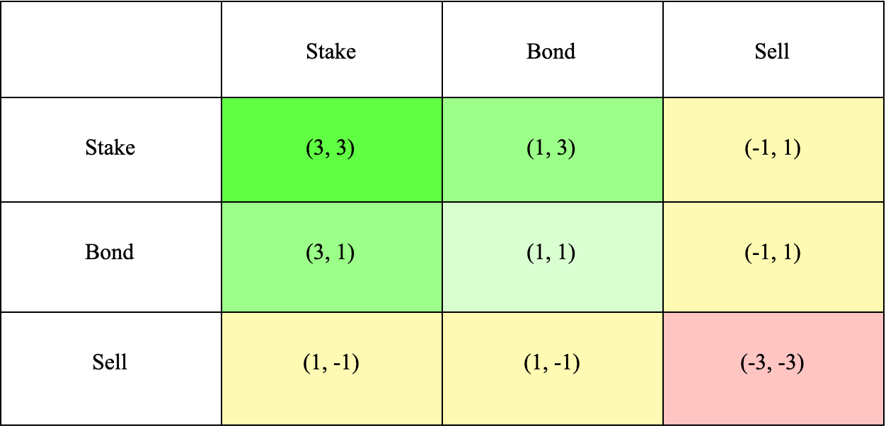

# (3,3) Aligned Participation

<figure><figcaption></figcaption></figure>

The meme is useful, but the old payoff table was never a complete market model. Staking does not create outside value on its own, minting is helpful only when the treasury receives sufficient value, and selling can be rational for liquidity, risk management, or price discovery.

## Pulsar's version of (3,3)

For Pulsar, alignment means:

* **Stake:** choose long-term participation when it fits your own risk tolerance.
* **Mint responsibly:** participate when the terms are sensible for you and risk-adjusted value accrues to the treasury.
* **Build:** strengthen liquidity, integrations, education,  transparency, and treasury productivity.
* **Compound:** retain enough earnings and capital to grow the protocol's future earning power.

The best collective outcome is not “nobody ever sells.” It is a system where incentives, risk limits, disclosure, and productive capital are aligned well enough to survive normal market behavior.

## The modern rule

$$\left(3,3\right)_{\mathrm{Pulsar}} = \text{Align} + \text{Build} + \text{Compound}$$

No meme removes price risk. Every participant remains responsible for position sizing, security, taxes, liquidity needs, and independent research.
